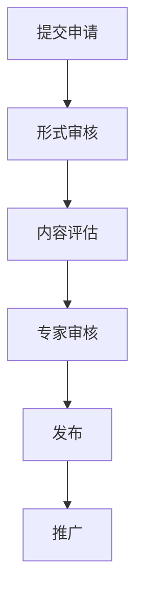

## 信息发布平台价值

维森视觉检测仪器网信息发布平台是连接技术创新与行业需求的桥梁。我们致力于：

1. 🌐 **信息传播**：打破信息壁垒，促进技术交流
2. 📊 **趋势洞察**：提供专业、前沿的技术趋势分析
3. 🚀 **创新展示**：为企业提供展示技术实力的平台
4. 🤝 **资源对接**：链接技术供给方与需求方

## 发布流程

## 发布政策

- ✅ 原创性：鼓励原创技术文章和案例分享
- 🔍 专业性：严格把控信息质量和专业度
- 🌈 多样性：覆盖不同类型的技术资讯
- 🔒 保密性：尊重知识产权，保护企业隐私

## 适用范围

- 视觉检测设备技术文章
- 内窥镜创新应用案例
- 行业解决方案分享
- 技术发展趋势报告
- 企业技术实力展示

## 联系我们

如果您有意向在我们的平台发布信息，请通过右侧表单提交申请，或直接发送邮件至 `publish@visndt.com`。
