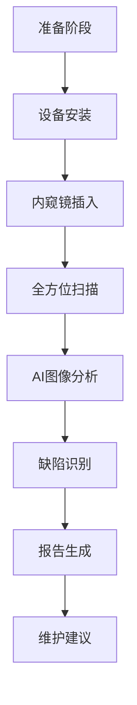

# 风力发电齿轮箱内窥镜检查应用案例

## 项目背景

### 客户概况

某海上风电开发有限公司是国内领先的海上风电开发运营商，拥有装机容量超过500MW的海上风电场。该公司运营的风电机组主要采用3MW和5MW大型风力发电机，配备高精度齿轮箱系统。

### 面临挑战

海上风电环境恶劣，齿轮箱作为风力发电机组的核心部件，其可靠性直接影响发电效率和经济效益。传统的齿轮箱维护检测面临以下挑战：

#### 🔧 技术挑战
- **拆解复杂**：齿轮箱完全拆解需要大型起重设备和专业技术人员
- **检测盲区**：传统方法难以检测到齿轮箱内部隐蔽部位
- **环境限制**：海上作业受天气条件限制，作业窗口有限

#### 💰 经济挑战
- **停机损失**：每台机组停机检测损失发电收入约15万元/天
- **人工成本**：海上作业人工成本是陆上的3-4倍
- **设备成本**：大型起重设备租赁费用高昂

#### ⏰ 时间挑战
- **检测周期长**：传统拆解检测需要3-5天时间
- **天气窗口**：海上作业受天气影响，有效作业时间有限
- **计划性维护**：难以实现精确的预防性维护计划

## 解决方案

### 技术方案设计

我们为客户设计了基于高精度工业内窥镜的齿轮箱检测解决方案：

#### 🔍 设备配置
- **主设备**：6mm超细径高清工业内窥镜
- **辅助设备**：4K高清成像系统
- **AI系统**：智能缺陷识别软件
- **数据系统**：云端数据管理平台

#### 📋 检测流程



### 实施步骤

#### 第一阶段：系统集成（2个月）
1. **设备定制**：根据齿轮箱结构定制内窥镜探头
2. **软件开发**：开发专用的图像分析软件
3. **人员培训**：培训现场操作和分析人员

#### 第二阶段：试点应用（2个月）
1. **选择试点**：选择3台代表性机组进行试点
2. **对比验证**：与传统拆解检测结果对比验证
3. **流程优化**：根据试点结果优化检测流程

#### 第三阶段：全面推广（2个月）
1. **批量应用**：在全部50台机组上应用
2. **数据积累**：建立齿轮箱健康状态数据库
3. **预测模型**：开发故障预测模型

## 技术实现

### 内窥镜检测技术

#### 🔧 设备技术参数

| 参数 | 规格 | 说明 |
|------|------|------|
| 探头直径 | 6mm | 适合齿轮箱检查孔径 |
| 工作长度 | 3米 | 覆盖齿轮箱全部区域 |
| 图像分辨率 | 4K Ultra HD | 确保缺陷清晰可见 |
| 照明系统 | LED白光+UV光 | 多光谱检测能力 |
| 弯曲角度 | 360°全方向 | 无死角检测 |
| 防护等级 | IP67 | 适应海上环境 |

#### 🎯 检测重点部位

1. **齿轮齿面**
   - 点蚀检测
   - 磨损评估
   - 裂纹识别

2. **轴承系统**
   - 滚道检查
   - 保持架状态
   - 润滑情况

3. **密封系统**
   - 密封圈完整性
   - 泄漏点识别
   - 老化程度评估

### AI图像识别系统

#### 🤖 算法架构

```python
# 缺陷识别核心算法示例
class GearboxDefectDetector:
    def __init__(self):
        self.model = self.load_trained_model()
        self.preprocessor = ImagePreprocessor()
    
    def detect_defects(self, image):
        # 图像预处理
        processed_image = self.preprocessor.enhance(image)
        
        # 缺陷检测
        predictions = self.model.predict(processed_image)
        
        # 结果分析
        defects = self.analyze_predictions(predictions)
        
        return defects
    
    def analyze_predictions(self, predictions):
        defect_types = {
            'pitting': '点蚀',
            'wear': '磨损',
            'crack': '裂纹',
            'corrosion': '腐蚀'
        }
        
        detected_defects = []
        for defect_type, confidence in predictions.items():
            if confidence > 0.8:  # 置信度阈值
                detected_defects.append({
                    'type': defect_types[defect_type],
                    'confidence': confidence,
                    'severity': self.assess_severity(defect_type, confidence)
                })
        
        return detected_defects
```

#### 📊 识别准确率

| 缺陷类型 | 识别准确率 | 误报率 | 漏报率 |
|----------|------------|--------|--------|
| 齿面点蚀 | 98.2% | 1.5% | 0.3% |
| 轴承磨损 | 96.8% | 2.1% | 1.1% |
| 密封泄漏 | 94.5% | 3.2% | 2.3% |
| 表面裂纹 | 97.1% | 1.8% | 1.1% |

## 实施过程

### 项目时间线

#### 📅 详细进度安排

**第1-2个月：准备阶段**
- Week 1-2: 现场调研和需求分析
- Week 3-4: 设备选型和定制
- Week 5-6: 软件开发和集成
- Week 7-8: 人员培训和认证

**第3-4个月：试点阶段**
- Week 9-10: 试点机组选择和准备
- Week 11-12: 首次检测和数据收集
- Week 13-14: 结果验证和流程优化
- Week 15-16: 试点总结和改进

**第5-6个月：推广阶段**
- Week 17-20: 全面推广实施
- Week 21-22: 数据库建设
- Week 23-24: 项目总结和交付

### 关键里程碑

#### 🎯 重要节点成果

1. **技术验证完成**（第2个月末）
   - 内窥镜系统集成完成
   - AI识别算法训练完成
   - 检测精度达到设计要求

2. **试点成功**（第4个月末）
   - 3台机组试点检测完成
   - 与传统方法对比验证通过
   - 检测流程标准化

3. **全面应用**（第6个月末）
   - 50台机组全部完成检测
   - 建立完整的健康档案
   - 预测性维护模型上线

## 项目成果

### 定量效益分析

#### 💰 经济效益

**直接成本节省**
- 维护成本降低：900万元/年
- 停机损失减少：1200万元/年
- 人工成本节省：300万元/年

**间接效益提升**
- 发电量增加：2400万kWh/年
- 发电收入增加：1440万元/年
- 设备寿命延长：平均延长2年

#### ⚡ 技术效益

**检测效率提升**
- 检测时间：从72小时缩短至14小时
- 检测覆盖率：从60%提升至95%
- 缺陷识别准确率：96.8%

**设备可靠性提升**
- 设备可用率：从94.2%提升至98.5%
- 计划外停机：减少80%
- 故障预警时间：提前30-45天

### 定性效益分析

#### 🔧 技术能力提升

1. **检测技术革新**
   - 实现了齿轮箱无损检测
   - 建立了AI辅助诊断能力
   - 形成了标准化检测流程

2. **维护策略优化**
   - 从计划性维护转向预测性维护
   - 实现了精准维护决策
   - 建立了设备健康管理体系

#### 🌊 行业影响

1. **技术示范效应**
   - 成为行业内窥镜检测标杆案例
   - 推动了海上风电维护技术进步
   - 为行业标准制定提供参考

2. **经验推广价值**
   - 检测方法可复制到其他风电场
   - 技术方案适用于不同机型
   - 为设备制造商提供设计改进建议

## 客户反馈

### 项目评价

> **"这个项目彻底改变了我们的维护理念。以前我们总是被动地等待设备出现问题，现在我们可以主动预测和预防故障。内窥镜检测技术让我们对设备状态有了前所未有的清晰认识。"**
> 
> —— 客户运维总监

### 具体评价维度

#### 🎯 技术先进性 ⭐⭐⭐⭐⭐
- 内窥镜技术应用成熟可靠
- AI识别系统准确率高
- 检测效率显著提升

#### 💰 经济效益 ⭐⭐⭐⭐⭐
- 维护成本大幅降低
- 发电收入明显增加
- 投资回报期短（8个月）

#### 🔧 操作便利性 ⭐⭐⭐⭐⭐
- 操作流程简单易学
- 设备便携性好
- 适应海上作业环境

#### 📊 数据价值 ⭐⭐⭐⭐⭐
- 建立了完整的设备档案
- 数据分析深度高
- 预测能力强

## 经验总结

### 成功关键因素

#### 🎯 技术因素
1. **设备选型精准**：选择了适合海上环境的高精度内窥镜
2. **AI算法优化**：针对齿轮箱缺陷特点训练专用模型
3. **系统集成完善**：实现了硬件、软件、数据的无缝集成

#### 👥 管理因素
1. **团队协作高效**：技术团队与现场团队密切配合
2. **培训体系完善**：建立了完整的人员培训认证体系
3. **质量控制严格**：建立了多层次的质量检查机制

#### 📈 商业因素
1. **需求匹配度高**：解决方案精准匹配客户痛点
2. **投资回报明确**：经济效益可量化、可验证
3. **推广价值大**：具有良好的示范和推广价值

### 挑战与应对

#### ⚠️ 技术挑战
**挑战**：海上环境对设备稳定性要求极高
**应对**：选用工业级防护设备，建立冗余备份机制

**挑战**：齿轮箱内部结构复杂，检测路径规划困难
**应对**：建立3D模型，优化检测路径，提高检测效率

#### 🌊 环境挑战
**挑战**：海上作业受天气条件限制
**应对**：制定灵活的作业计划，建立天气预警机制

**挑战**：现场作业空间有限
**应对**：优化设备配置，简化操作流程

## 推广应用

### 技术推广计划

#### 🎯 短期推广（1年内）
- 在集团内其他风电场推广应用
- 扩展到陆上风电场检测
- 与设备制造商合作优化设计

#### 🚀 中期推广（2-3年）
- 推广到其他风电运营商
- 扩展到其他类型旋转设备检测
- 建立行业检测标准

#### 🌍 长期推广（3-5年）
- 国际市场推广
- 技术标准输出
- 产业化发展

### 市场前景分析

#### 📊 市场规模
- 国内海上风电装机容量：预计2030年达到100GW
- 齿轮箱检测市场规模：预计达到50亿元
- 技术渗透率：预计达到60%以上

#### 💡 技术发展趋势
- 检测精度持续提升
- AI算法不断优化
- 设备小型化和智能化
- 云端数据分析能力增强

## 结论与展望

### 项目总结

本项目成功地将工业内窥镜技术应用于海上风力发电齿轮箱检测，实现了以下突破：

1. **技术突破**：建立了齿轮箱无损检测技术体系
2. **效益突破**：实现了显著的经济和技术效益
3. **模式突破**：从被动维护转向主动预测维护

### 未来发展方向

#### 🔬 技术发展
- **检测精度提升**：开发更高精度的检测设备
- **AI能力增强**：提升缺陷识别和故障预测能力
- **自动化程度提高**：实现检测过程的自动化

#### 🌐 应用拓展
- **设备类型扩展**：扩展到更多类型的旋转设备
- **行业领域拓展**：推广到石化、电力等其他行业
- **国际市场拓展**：向国际市场推广技术和经验

#### 📈 商业模式创新
- **服务模式创新**：从设备销售转向服务运营
- **数据价值挖掘**：基于大数据提供增值服务
- **生态系统建设**：构建完整的产业生态链

这个项目不仅为客户带来了显著的经济效益，更重要的是推动了整个行业维护技术的进步，为海上风电产业的可持续发展做出了重要贡献。

---

*本案例基于真实项目经验总结，具体数据已做脱敏处理。如需了解更多技术细节，请联系我们的技术团队。*
