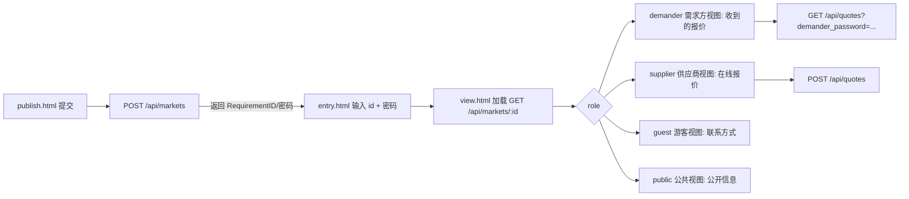
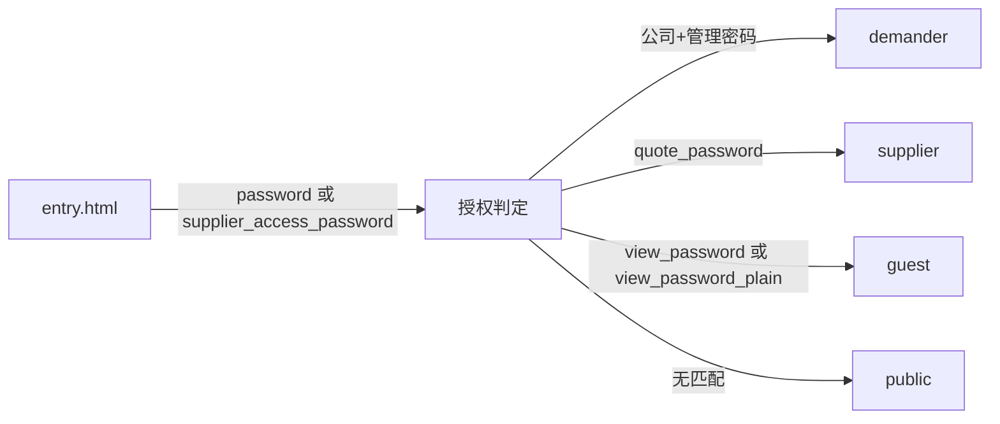

# 需求市场使用说明

本文面向需求方、供应商、游客与管理员，梳理需求市场的页面、弹窗、表单与功能逻辑，并给出使用与运维建议。

## 1. 核心概念

- 统一入口：通过 `entry.html` 使用“需求ID + 密码”进入，`view.html` 根据身份展示差异化视图。
- 角色与密码：
  - 需求方：管理/查看密码（发布后返回，亦作为 `view_password_plain`）
  - 供应商：该需求 `quote_password`，或自身 `supplier_access_password`
  - 游客：该需求的 `view_password`
  - 管理员：后台权限，维护需求与密码字段
- 开放报价：当需求开启 `allow_open_quotes` 时，供应商可在前台无需密码直接提交报价。

## 2. 页面与组件

### 2.1 发布需求（`static/publish.html`）
- 表单字段：标题、分类、联系人/电话/公司、公开预览、预算、是否公开联系方式。
- 提交到 `POST /api/markets`，成功返回：
  - 需求ID（显示并提供复制按钮）
  - 需求方管理密码（显示并提供复制按钮）
- 快捷按钮：进入入口页（携带 `id`）

### 2.2 统一入口（`static/entry.html`）
- 输入：`需求ID`、`访问密码`（查看/需求方/报价其一即可），可选 `供应商访问密码`。
- 行为：跳转到 `view.html?id=...&password=...&supplier_access_password=...`。
- 回填：若 URL 已带 `id`/`supplier_access_password`，自动填入对应输入框。

### 2.3 需求视图（`static/view.html`）
- 加载：`GET /api/markets/:id`，携带 `password` 或 `supplier_access_password`。
- 视图差异：
  - 需求方视图：可查看报价列表、刷新、管理相关信息。
  - 供应商视图：显示报价表单（开放报价或提供了密码时）。
  - 游客视图：在提供 `view_password` 时可见联系方式。
- 表单：报价提交到 `POST /api/quotes`（包含 `requirement_id/supplier_name/phone/amount/currency/remarks`，必要时携带授权密码）。
- 其他：支持“刷新报价”、返回入口页以更换密码身份。

### 2.4 前台需求中心（`static/js/requirements-center.js`）
- 列表与筛选：从公开接口加载需求列表，支持过滤与卡片样式展示。
- 详情弹窗：
  - 时间线（已发布/沟通中/已完成）
  - 基本信息、描述与技术参数块
  - 联系方式解锁区：先用 `view_password` 验证，失败则尝试 `supplier_access_password`
  - 报价表单：默认折叠；开放报价时可直接提交
- 建议：非开放报价场景请通过统一入口进入，以确保密码随表单提交携带。

### 2.5 管理后台（`static/management.html`）
- 需求方索引：汇总同公司需求，列表支持“入口”与“详情”。
- 供应商索引：分页加载、搜索筛选。
- 需求详情模态框：可维护 `quote_password` 与 `view_password`，以及 `view_password_plain`（历史字段）。
- 保存：管理员白名单字段包括 `status/progress/contact_public/view_password_plain/quote_password/view_password`。

## 3. 典型流程

### 3.1 发布 → 入口 → 查看/报价
1) 在发布页填写需求信息并提交；复制系统返回的“需求ID/管理密码”。
2) 进入入口页，输入 `id` 与相应密码；跳转到视图页。
3) 需求方可查看报价列表并刷新，供应商可提交报价，游客在有 `view_password` 时可查看联系方式。

### 3.2 供应商报价（两种授权）
- 开放报价：直接在视图页的表单提交。
- 受限报价：
  - 填写该需求 `quote_password`（入口页“访问密码”）或
  - 填写自身 `supplier_access_password`（入口页“供应商访问密码”）

### 3.3 管理员运维
1) 在管理后台搜索定位需求，打开详情模态。
2) 设置或更新 `quote_password` 与 `view_password`，控制报价与联系方式访问权限。
3) 按需更新 `status/progress/contact_public`，协调前台展示行为。

## 4. 接口与授权概览

- 列表：`GET /api/markets`（公开列表，受审核且状态为公开）
- 详情：`GET /api/markets/:id`
  - 身份判定：
    - 需求方：公司匹配 + 管理密码
    - 供应商：该需求 `quote_password`
    - 游客：该需求 `view_password` 或历史 `view_password_plain`
  - 数据裁剪：按身份返回必要字段，联系方式在有权时可见，需求方视图附带报价列表
- 报价提交：`POST /api/quotes`
  - 授权：`allow_open_quotes` 或提供 `quote_password`/`supplier_access_password`
- 管理更新：`PATCH /api/admin/requirements/:id`
  - 白名单：`status/progress/contact_public/view_password_plain/quote_password/view_password`

### 4.1 接口字段与示例

- `POST /api/markets` 创建需求（cloudflare/src/index.js）
  - 请求体示例：
    ```json
    {
      "Title": "电子内窥镜采购",
      "primaryCategory": "电子内窥镜",
      "contactName": "张三",
      "contactPhone": "13800000000",
      "contactCompany": "某医院",
      "PublicPreview": "简要描述…",
      "BudgetRange": "10万-20万",
      "ContactPublic": false
    }
    ```
  - 响应体：`{ ok: true, requirement_id, ViewPassword, DemanderPassword }`

- `GET /api/markets` 列表（cloudflare/src/index.js）
  - 可选查询：`progress`、`category`
  - 返回数组项包含：`RequirementID/Title/PublicPreview/PrimaryCategory/Status/ContactPublic/BudgetRange/PublishedAt/Progress/AllowOpenQuotes/Parameters`

- `GET /api/markets/:id` 详情（cloudflare/src/index.js）
  - 查询参数：`password`、`supplier_access_password`、`view_password`
  - 返回：`{ role, requirement, quotes? }`
  - `role` 值：`demander | supplier | guest | public`
  - `requirement` 基本字段总是返回；在具备权限时附带 `ContactName/Phone/Company/Email/Department`
  - 当 `role=demander` 时返回 `quotes` 列表

- `POST /api/quotes` 提交报价（cloudflare/src/index.js:403-444）
  - 请求体：`requirement_id/supplier_name/amount` 必填；可选 `supplier_phone/currency/remarks`；授权可选 `password/supplier_access_password`
  - 返回：`{ QuoteID }`
  - 授权逻辑：开启 `allow_open_quotes` 或匹配 `quote_password` 或有效 `supplier_access_password`

- `GET /api/quotes` 报价列表（cloudflare/src/index.js:446-494）
  - 查询：`requirement_id`、可选 `supplier_id`；授权用 `view_password/supplier_access_password/demander_password` 或管理员头部
  - 返回数组：`quote_id/requirement_id/supplier_id/supplier_name/supplier_phone/amount/currency/remarks/status/created_at`

  - `PATCH /api/markets/:id`（管理员或需求方）
  - 需求方可更新：`status/progress/contact_public`
  - 管理员额外可更新：`view_password_plain/quote_password/view_password`

### 4.2 入口与视图页参数

- `entry.html` 读取并传递参数：`id/password/supplier_access_password`（static/entry.html:67-71）
- `view.html` 装载详情并识别身份：
  - 读取参数与调用接口（static/view.html:142-156）
  - 渲染角色与信息（static/view.html:165-221）
  - 刷新报价（static/view.html:223-233）
  - 提交报价（static/view.html:234-263）
  - DOM 初始化与“切换密码”（static/view.html:265-274）

## 5. 操作指南

- 需求方：保存发布后返回的密码；从入口进入查看报价、更新进度；必要时在后台设置游客密码开放联系方式。
- 供应商：使用 quote 密码或通行密码进入入口；在视图页提交报价并记录 QuoteID；如需求未开放报价，务必携带密码。
- 游客：从入口输入 `view_password`；视图页可见联系方式与基础信息。
- 管理员：在后台维护密码与状态，使用“入口”按钮快速联动到统一入口核验前台行为。

### 5.1 权限矩阵（概要）

- 需求方
  - 入口：`entry.html` 使用管理密码（同 `view_password_plain`）
  - 能力：查看报价列表、刷新、更新进度/状态/联系方式公开性
- 供应商
  - 入口：使用该需求 `quote_password` 或自身 `supplier_access_password`
  - 能力：提交报价；在具备 `supplier_access_password` 时可带出 `supplier_id`
- 游客
  - 入口：使用该需求 `view_password`
  - 能力：查看联系方式与公开信息
- 管理员
  - 能力：批量/单条更新需求；设置 `quote_password/view_password`；导出数据；重置/清理

## 6. 常见问题与建议

- 为什么采用统一入口？降低路径复杂度，避免角色分流导致的“拿错密码/丢失上下文”。
- 联系方式显示条件？需要游客密码或供应商/需求方授权；公共列表不直接暴露联系方式。
- 何时使用开放报价？当希望快速收集多方报价且不设准入时；否则设置 `quote_password` 控制权益。
- 密码安全：避免在日志与公共渠道暴露；建议在发布成功卡片一键复制并安全存档。

### 6.1 典型错误与排查

- 发布失败（400）`Missing fields`
  - 排查：检查必填 `Title/primaryCategory/contactName/contactPhone`（cloudflare/src/index.js:199-204）
- 详情未授权（401）`Unauthorized`
  - 排查：确认 `password` 是否为该公司需求方密码，或 `quote_password/view_password` 是否与该需求匹配；供应商可用 `supplier_access_password`
- 需求不存在（404）`NotFound`
  - 排查：确认 `RequirementID` 是否正确（cloudflare/src/index.js:271-277）
- 报价未授权（401）`Unauthorized`
  - 排查：需求是否未开启开放报价；提供 `quote_password` 或 `supplier_access_password`（cloudflare/src/index.js:415-434）
- 管理更新失败（400/404）`NoFields/UpdateFailed`
  - 排查：是否提交了允许更新的字段；`requirement_id` 是否存在（cloudflare/src/index.js:391-400）

### 6.2 使用建议

- 严控联系方式：默认不公开，按需使用游客密码开放；或在视图页依据供应商/需求方密码展示。
- 减少密码传递次数：优先通过统一入口进行身份识别，然后在视图页完成操作。
- 开放报价与准入：对不同需求灵活设置 `allow_open_quotes` 与 `quote_password`，兼顾效率与安全。

## 7. 代码锚点（便于维护）

- 入口页参数传递：`static/entry.html:67-71`
- 视图页授权与表单：`static/view.html:145-156, 217-219, 245-259`
- 前台详情弹窗密码校验：`static/js/requirements-center.js:1101-1128`
- 管理模态密码字段与保存：`static/management.html:1431, 1435, 1542-1544`
- 列表接口与详情裁剪：`cloudflare/src/index.js:246-269, 271-336`
- 报价提交与列表授权：`cloudflare/src/index.js:423-444, 446-483`

## 8. 部署与配置

- Cloudflare Workers 环境变量（示例）：
  - `ADMIN_KEY` 或 `ADMIN_KEY_SECRET/ADMIN_TOKEN`：管理员头部鉴权（cloudflare/src/index.js:145-147）
  - `ADMIN_PASSWORD`：管理员密码（用于 `POST /api/admin/verify` 体内验证，cloudflare/src/index.js:186）
  - `DB`：Cloudflare D1 绑定，存储需求/报价/供应商/需求方数据
- CORS 白名单：可在 `allowedOrigins` 中维护（cloudflare/src/index.js:10-21）
- D1 轻量迁移：自动尝试新增 `quote_password/view_password` 列（cloudflare/src/index.js:69-71）

## 9. 示例操作（演练）

- 发布并进入入口：
  1) 打开 `publish.html`，填写信息并提交
  2) 在成功卡片点击“复制ID/复制密码”，点击“进入入口页”跳转（static/publish.html:57-65, 83-99）
  3) 在入口页补充密码并进入视图页
- 供应商受限报价：
  1) 在入口页输入 `id` 与 `quote_password` 或 `supplier_access_password`
  2) 在视图页填写报价表单并提交（static/view.html:234-263）
- 需求方查看报价：
  1) 在入口页输入管理密码进入
  2) 在视图页点击“刷新报价”，查看最新列表（static/view.html:223-233）

## 10. 可视化流程图（Mermaid）





## 11. 接口 curl 示例

- 创建需求
```bash
curl -s -X POST 'http://localhost:8000/api/markets' \
  -H 'Content-Type: application/json' \
  -d '{
    "Title":"电子内窥镜采购",
    "primaryCategory":"电子内窥镜",
    "contactName":"张三",
    "contactPhone":"13800000000",
    "contactCompany":"某医院",
    "PublicPreview":"简要描述…",
    "BudgetRange":"10万-20万",
    "ContactPublic":false
  }'
```

- 获取公开列表
```bash
curl 'http://localhost:8000/api/markets?category=%E7%94%B5%E5%AD%90%E5%86%85%E7%AA%A5%E9%95%9C'
```

- 详情（携带密码）
```bash
curl 'http://localhost:8000/api/markets/REQ-20250101-1234?password=123456&supplier_access_password=sup-abc'
```

- 供应商提交报价（受限）
```bash
curl -s -X POST 'http://localhost:8000/api/quotes' \
  -H 'Content-Type: application/json' \
  -d '{
    "requirement_id":"REQ-20250101-1234",
    "supplier_name":"某供应商",
    "supplier_phone":"13900000000",
    "amount":20000,
    "currency":"CNY",
    "remarks":"型号X，交期15天",
    "password":"quote-xxx"
  }'
```

- 需求方查看报价列表
```bash
curl 'http://localhost:8000/api/quotes?requirement_id=REQ-20250101-1234&demander_password=123456'
```

- 供应商查看报价（按通行密码）
```bash
curl 'http://localhost:8000/api/quotes?requirement_id=REQ-20250101-1234&supplier_access_password=sup-abc'
```

- 管理员更新需求密码
```bash
curl -s -X PATCH 'http://localhost:8000/api/markets/REQ-20250101-1234' \
  -H 'Content-Type: application/json' \
  -H 'X-Admin-Key: <YOUR_ADMIN_KEY>' \
  -d '{
    "view_password":"guest-123",
    "quote_password":"quote-456"
  }'
```

## 12. 字段字典（概要）

### 12.1 requirements

| 字段 | 说明 |
|---|---|
| requirement_id | 需求ID（唯一） |
| title | 标题 |
| public_preview | 公开预览文案 |
| primary_category | 一级分类 |
| secondary_category | 二级分类 |
| approved/approved_at | 审核标记与时间 |
| status | 状态（公开/关闭/在线报价等） |
| contact_name/phone/company/email/department | 联系信息 |
| contact_public | 是否公开联系方式 |
| allow_open_quotes | 是否开放在线报价 |
| parameters_json | 技术参数 JSON |
| budget_range | 预算范围 |
| published_at | 发布时间 |
| progress | 进度（已发布/沟通中/已完成） |
| view_password_plain | 历史游客密码（明文） |
| view_password | 游客密码（新） |
| quote_password | 报价密码（每需求） |

### 12.2 quotes

| 字段 | 说明 |
|---|---|
| quote_id | 报价单号（唯一） |
| requirement_id | 需求ID |
| supplier_id | 供应商ID（可选，通行密码推断） |
| supplier_name/phone | 供应商名称/电话 |
| amount/currency | 报价金额/币种 |
| remarks | 报价备注 |
| status | 状态（submitted/updated等） |
| created_at/updated_at | 时间戳 |

### 12.3 suppliers

| 字段 | 说明 |
|---|---|
| supplier_id | 供应商ID（唯一） |
| name/company | 名称/公司 |
| access_password_plain | 供应商通行密码（明文） |
| contact_phone/email | 联系方式 |
| status | 状态（active/disabled） |
| metadata_json | 附加信息 |

### 12.4 demanders

| 字段 | 说明 |
|---|---|
| demander_id | 需求方ID（唯一） |
| name/company | 名称/公司 |
| contact_phone/email | 联系方式 |
| department | 部门 |
| metadata_json | 附加信息（含 password_plain 等） |

## 13. 安全与合规

- 不在前台日志或公开渠道记录任何密码字段。
- 管理员接口使用 `X-Admin-Key` 头部或 `POST /api/admin/verify` 密码体鉴权。
- CORS 白名单维护在 Workers 代码 `allowedOrigins` 集合，限制跨域来源。

---

版本：v1.1（增加流程图、curl 示例与字段字典）
